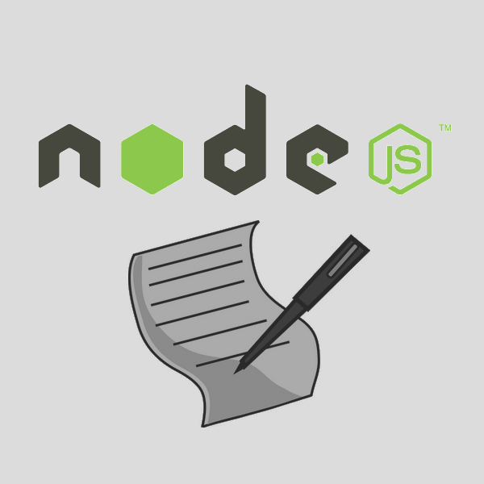

#NodeBlog - A blogging platform built on Node.js

##Description
NodeBlog is a full stack blogging platform, including a utility to write and publish posts in Markdown, as well as Facebook-authenticated comments. This utility was developed and written entirely in JavaScript, HTML and CSS using Node.js, ExpressJS, MongoDB and the Facebook SDK.

##Installation
First, you would want to make sure that you have all of the basic dependencies installed: *Node.js*, and *npm* (Node package manager).

After this, navigate to the project folder and proceed to install all Node.js dependencies using the following:
```
npm install
```
After this is done, get an app id for your blog from Facebook. This is required for Facebook authentication, comments and secure posting. Navigate to the [Facebook Developer's Page](http://developers.facebook.com), click on the 'Apps' tab, and then 'Create a New App'.

After following the instructions on screen to create a new app, find your application ID by looking through the app seetings. This app ID is required for the proper usage of NodeBlog.
##Contact
If you have any questions/suggestions, contact me at http://rukmal.me.
##Note
This project is currently in development, and is NOT ready for use.
